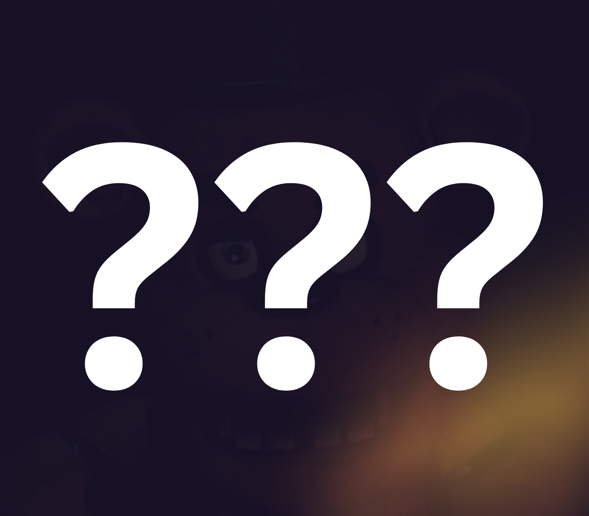

# kylehovo's Byte-le Royale Submission (2026)

## Building

```sh
git clone https://github.com/kylehovo/NDSU-Byte-le-2026
cd NDSU-Byte-le-2026

chmod +x install.sh run.sh
./install.sh # Requires an internet connection
./run.sh     # Runs the game and the visualizer
```

## Context

- [NDSU ACM Website (Byte-le Royale)](https://royale.ndacm.org/)
- [QBB Security Manual (Official Documentation)](https://ndacm.org/Byte-le-Engine-v2-2026/)
- [NDSU ACM on Twitch](https://www.twitch.tv/ndsu_acm)
- [UND ACM Website](https://und.acm.org/)
- [Upstream of This Repo](https://github.com/kylehovo/NDSU-Byte-le-2026)

### The Image

> What's the next game? 🤔


